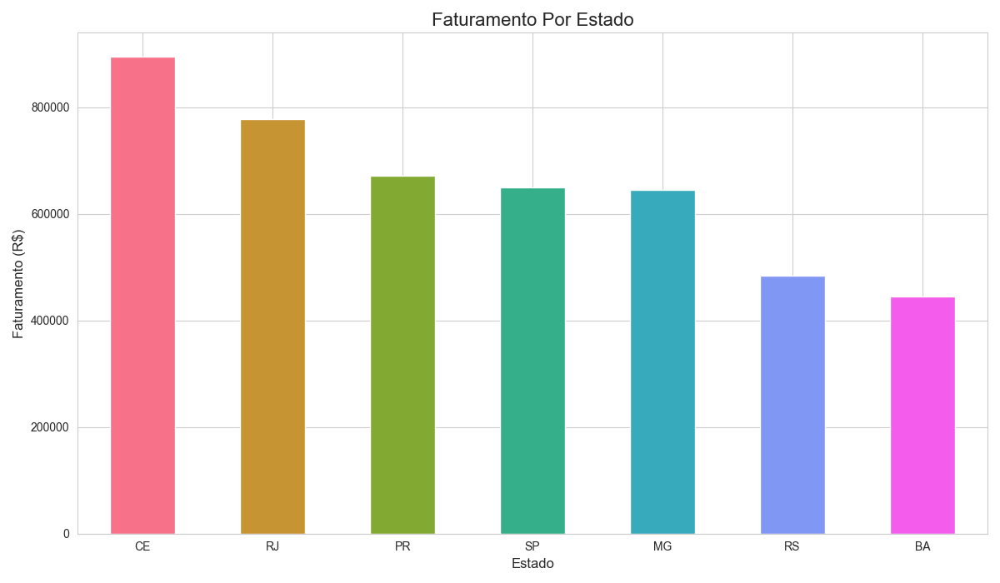
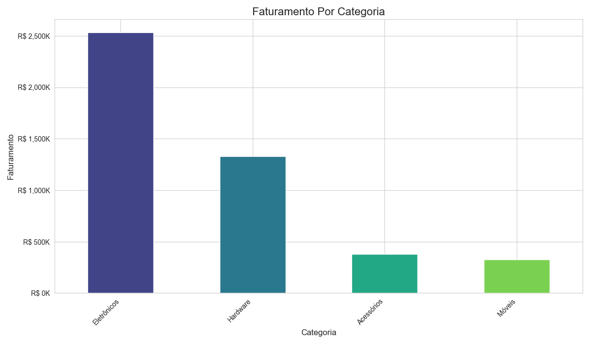

# Conteúdo do README baseado nas informações fornecidas e no tom profissional solicitado

Este projeto didático consiste no desenvolvimento de um ecossistema de Business Intelligence voltado para a otimização de operações de e-commerce. A aplicação processa volumes crescentes de transações brutas para extrair insights estratégicos, transformando dados desestruturados em indicadores de performance (KPIs) que fundamentam decisões sobre gestão de inventário, segmentação de marketing e expansão regional.

O foco principal foi a construção de um pipeline de dados ponta a ponta que realiza a limpeza, agregação e visualização de métricas sazonais e geográficas. Utilizando uma interface interativa, o sistema permite identificar padrões de consumo e "campeões de venda", substituindo a tomada de decisão baseada em intuição por uma cultura orientada a dados (*data-driven*), capaz de antecipar tendências de mercado e otimizar o retorno sobre investimento (ROI) das campanhas operacionais.

## Competências Desenvolvidas

* **Manipulação e Tratamento de Dados:** Utilização de Pandas e NumPy para limpeza e estruturação de datasets volumosos.
* **Análise Estatística:** Identificação de tendências sazonais e padrões de comportamento de compra.
* **Visualização de Dados e Storytelling:** Criação de gráficos explicativos com Matplotlib e Seaborn.
* **Desenvolvimento de Dashboards:** Implementação de interface interativa com Streamlit para visualização de métricas em tempo real.
* **Programação Modular:** Estruturação de código limpo e reutilizável seguindo padrões profissionais em Python.

## Problema de Negócio

A loja de e-commerce apresentava desafios típicos de crescimento:
* **Gestão de Estoque Ineficiente:** Falta de clareza sobre produtos com alta e baixa rotatividade.
* **Marketing com Baixo Retorno:** Campanhas genéricas sem segmentação geográfica ou por categoria.
* **Perda de Oportunidades Sazonais:** Dificuldade em prever períodos de alta demanda.
* **Expansão sem Direção:** Incerteza sobre quais mercados regionais priorizar.

## Objetivos do Projeto

Para solucionar os problemas acima, o projeto responde a quatro perguntas fundamentais:
1.  **O que vender?** Identificação de produtos de maior sucesso.
2.  **Onde focar?** Análise das categorias que geram maior receita.
3.  **Quando agir?** Identificação de picos de vendas e sazonalidade.
4.  **Para onde expandir?** Mapeamento geográfico da performance de vendas.

## Tecnologias e Ferramentas

* **Linguagem:** Python 3.12
* **Ambiente:** Linux Mint / VS Code / Jupyter Notebook
* **Bibliotecas:** Pandas, NumPy, Matplotlib, Seaborn e Streamlit.

## Visualização dos Resultados

## Top 10 produtos mais vendidos

## Evolução do faturamento mensal

## Faturamento por estado

## Faturamento por categoria

---